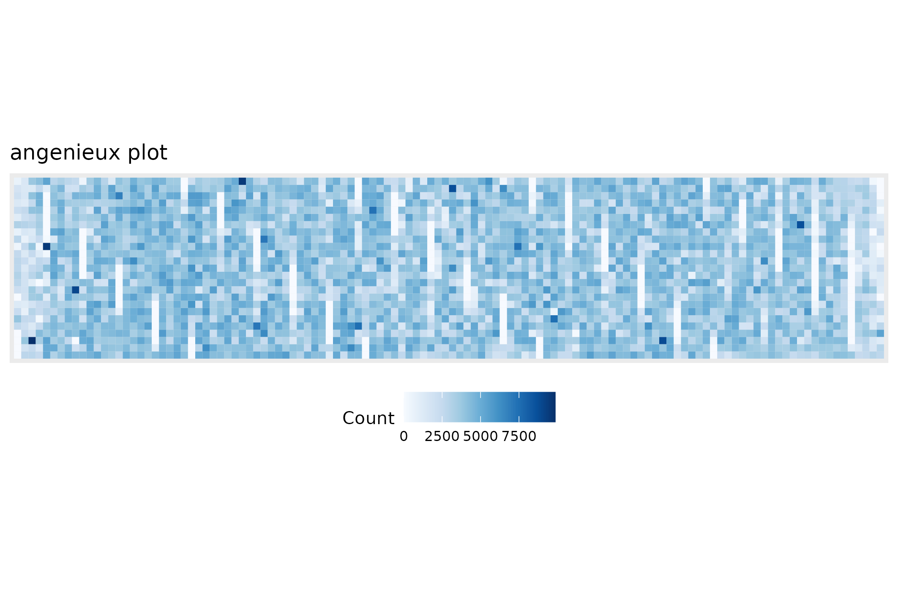

```{r, include = FALSE}
knitr::opts_chunk$set(
  collapse = TRUE,
  comment = "#>"
)
```

## Preamble

This `sequencing_summary_review` vignette re-introduces the `BasicQC`-type
tutorial that was previously available through the https://github.com/nanoporetech
website.

The workflow provided is implemented through the R TidyVerse and is intended to
provide a lightweight set of components that can be mixed and matched for the
exploration of the sequencing_summary file that is produced during Guppy-based
base-calling.

```{r setup}
library(floundeR)
library(ggplot2)
```


## Using a real-world sequencing_summary file.

The `floundeR` R package provides an example *sequencing_summary* file. This is
10,000 sequence reads long and provides insight into what is possible with the
software. For this demonstration we'll have a look at something a little more
impressive and illustrative of what the software is intended to do.

[s3://ont-open-data](https://registry.opendata.aws/ont-open-data/) is a data
repository hosted by Amazon. The human genome, GM24385 / HG002, has been
sequenced on a PromethION and deposited at the registry [read the blog post](https://nanoporetech.github.io/ont-open-datasets/gm24385_2020.11/). We will
download the dataset to demonstrate what can be done.

```{r downloadGM24385}
# let's just log where the file is being downloaded
print(getwd())

sequencing_summary <- "sequencing_summary_PAG07165_2dfda515.txt"
# don't perform the AWS download if the file has already been grabbed ...
if (!file.exists(sequencing_summary)) {
aws.s3::save_object(
  "/gm24385_2020.11/flowcells/20201026_1645_6B_PAG07165_d42912aa/sequencing_summary_PAG07165_2dfda515.txt",
  bucket="s3://ont-open-data/", 
  region="eu-west-1", 
  overwrite=FALSE)
}
```


## Define input files and create R6 object

```{r create_ss}
seqsum <- SequencingSummary$new(sequencing_summary)

# check the flowcell platform - ensures that something valid has been created
seqsum$flowcell$platform
```


## Plot flowcell spatial density

```{r, spatial_density}
figure_1 <- seqsum$flowcell$density_data$plot
ggplot2::ggsave("figure_1.png", plot = figure_1, device = "png")

```
