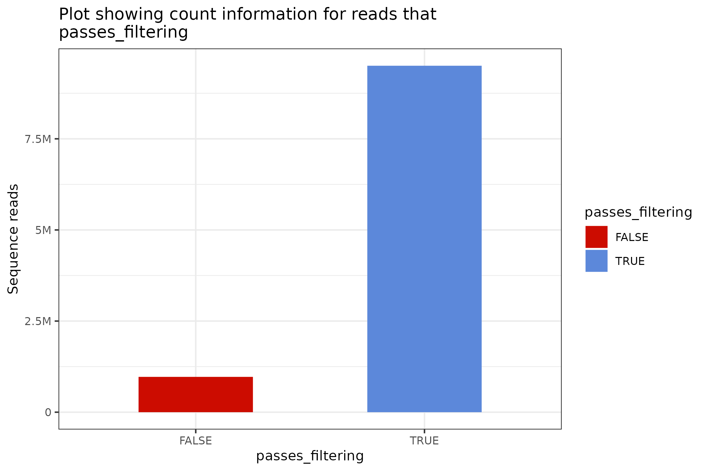

```{r, include = FALSE}
knitr::opts_chunk$set(
  collapse = TRUE,
  comment = "#>"
)
```

## Preamble

This `sequencing_summary_review` vignette re-introduces the `BasicQC`-type
tutorial that was previously available through the https://github.com/nanoporetech
website.

The workflow provided is implemented through the R TidyVerse and is intended to
provide a lightweight set of components that can be mixed and matched for the
exploration of the `sequencing_summary` file that is produced during Guppy-based
base-calling.

This report is feature-complete with the earlier `BasicQC` tutorial but has been
implemented with a different set of rules and expectations. Feedback is
welcomed.


```{r setup}
library(floundeR)
library(ggplot2)
```


## Using a real-world sequencing_summary file.

The `floundeR` R package provides an example *sequencing_summary* file. This is
10,000 sequence reads long and provides insight into what is possible with the
software. For this demonstration we'll have a look at something a little more
impressive and illustrative of what the software is intended to do.

[s3://ont-open-data](https://registry.opendata.aws/ont-open-data/) is a data
repository hosted by Amazon. The human genome, GM24385 / HG002, has been
sequenced on a PromethION and deposited at the registry [read the blog post](https://nanoporetech.github.io/ont-open-datasets/gm24385_2020.11/). We will
download the dataset to demonstrate what can be done.

```{r downloadGM24385}
sequencing_summary <- "sequencing_summary_PAG07165_2dfda515.txt"

# don't perform the AWS download if the file has already been grabbed ...
if (!file.exists(sequencing_summary)) {
aws.s3::save_object(
  "/gm24385_2020.11/flowcells/20201026_1645_6B_PAG07165_d42912aa/sequencing_summary_PAG07165_2dfda515.txt",
  bucket="s3://ont-open-data/", 
  region="eu-west-1", 
  overwrite=FALSE)
}
```


## Define input files and create the `SequencingSummary` R6 object

The `floundeR` package has been implemented largely as object oriented R through
the usage of `R6 objects`. This means that instead of passing tables of data
between methods that filter and visualise data facets we will be processing
objects that contain their own methods and filters.

The first step in the process is to create out very first object; this is
a `SequencingSummary` object and it is instantiated by calling its `initialize`
constructor with the `SequencingSummary$new()` call. We will pass the
`file.path` to our sequencing summary file.

Let's also check that the object creation has worked by asking about the
flowcell platform - this should return the expected sequencing platform.


```{r create_ss}
sequencing_summary <- flnDr("sequencing_summary.txt.bz2")
seqsum <- SequencingSummary$new(sequencing_summary)

# check the flowcell platform - ensures that something valid has been created
seqsum$flowcell$platform
```


## The `SequencingSet` and primitive QC measures

In the previous section we created our `SequencingSummary` object. We can
obtain a `SequencingSet` from the `SequencingSummary` object by calling its
`$sequencingset` active binding. 

```{r sequencingset}
seqsum$sequencingset
```

The `SequencingSet` in turn has a collection of methods that can be used to
structure and visualise the data. The first that we'll have a look at is the
`$enumerate` method that returns an `Angenieux` object for data visualisation.

```{r sequencingset_enumerate, out.width="65%"}
figure_2 <- seqsum$sequencingset$enumerate$plot
ggplot2::ggsave("figure_2.png", plot = figure_2, device = "png")

```

There are a plethora of ways through which the `Angenieux` object can be used
to style, colour and manipulate the graph - please do have a look at the methods
documentation.

## Plot flowcell spatial density

```{r, spatial_density}
figure_1 <- seqsum$flowcell$density_data$plot
ggplot2::ggsave("figure_1.png", plot = figure_1, device = "png")
knitr::include_graphics("figure_1.png")
```
